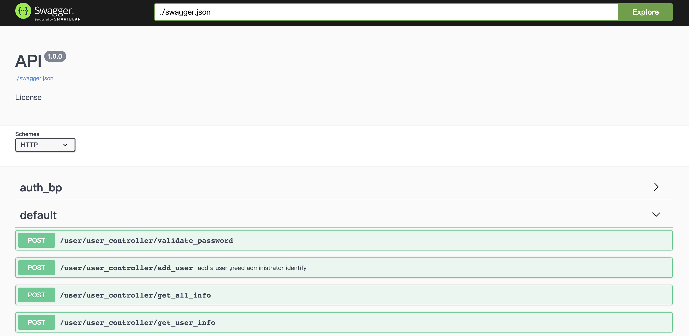

快速上手
______

安装
^^^^

.. code-block:: bash

    cd sanic-backend
    pip install -r backend/requirements.txt

修改配置文件
^^^^^^^^^^

不使用数据库的场景下可以不修改配置datasource下的参数

修改 backend/config/config.yaml文件

.. code-block:: yaml

    server:
      name: sanic_backend
      http:
        port: 8080

      component:
        controller: "backend.controller"
        service: "backend.service"
        repository: "backend.repository"
        datasource: "backend.core.datasource"

      log:
        debug: true
        backupCount: 10
        format: "[%(asctime)s %(levelname)s ] [%(filename)s:%(lineno)d %(module)s.%(funcName)s] %(message)s"
        filename: "logs/run.log"
        maxBytes: 102400

    datasource:
        mysql:
            db_name: xxx
            host: xx
            user: xx
            password: xx
            port: xx
            max_usage: 1000

运行
^^^^
.. important::
    再次之前需要配置好mysql数据库,运行mysql/create_database.sql脚步插入数据

.. code-block:: bash

    python sanic-backend/app.py

.. hint::
    打开浏览器 `http://localhost:8080/swagger <http://localhost:8080/swagger>`_

